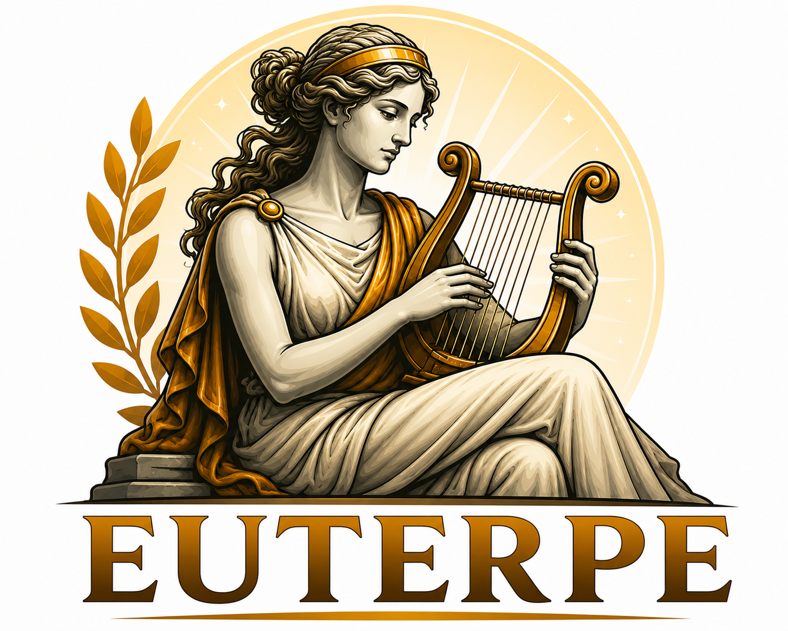

# Euterpe

Headless mediaspeler bestuurd via een webinterface. Audio wordt afgespeeld op de server (lokale speaker) via **MPV** als audio-engine. Alle logica — wachtrij, afspeellijsten, shuffle — zit in de backend.



## Stack

| Onderdeel | Technologie |
|-----------|-------------|
| Backend | **Node.js** — alleen ingebouwde modules (`http`, `fs`, `crypto`, `net`, …) |
| Frontend | **Vanilla HTML/CSS/JS** — geen build-stap, geen frameworks |
| Audio-engine | **MPV** via JSON IPC |
| Opslag | JSON-bestand + lokale audiobestanden |

**Geen npm-dependencies.** Alleen Node.js en MPV als externe vereisten.

## Vereisten

- [Node.js](https://nodejs.org/) 20+
- Audio-engine met JSON IPC:
  - **Arch / Linux:** [mpv](https://mpv.io/) (`pacman -S mpv`)
  - **Windows (dev):** [mpv.net](https://github.com/mpvnet-player/mpv.net) in `PATH` als `mpvnet`

## Windows (lokaal testen)

```powershell
copy .env.example .env   # EUTERPE_MPV_PATH=mpvnet
npm start
```

Open http://localhost:8000

Op Windows wordt standaard `mpvnet` gebruikt als `EUTERPE_MPV_PATH` niet is gezet. Zorg dat `mpvnet` in je PATH staat (`where mpvnet`).

## Arch Linux (productie)

```bash
sudo pacman -S nodejs mpv git
git clone <repo> /opt/euterpe && cd /opt/euterpe
chmod +x scripts/*.sh
sudo ./scripts/install-service.sh
```

In `/etc/euterpe/env`:

```bash
EUTERPE_MPV_PATH=mpv
EUTERPE_PORT=8000
```

## Starten (algemeen)

```bash
npm start
```

Open http://localhost:8000

### Productie (met auto-update bij herstart)

```bash
chmod +x scripts/*.sh
./scripts/run.sh
```

`run.sh` roept `restart.sh` aan in een loop. Bij elke exit van Node (ook via de **Herstart**-knop in de webinterface):

1. `git reset --hard HEAD`
2. `git pull`
3. Node opnieuw starten

Runtime-data in `data/` staat in `.gitignore` en blijft behouden bij updates.

De **Herstart**-knop sluit de server af; `run.sh` of systemd start daarna opnieuw met git pull.

### Systemd (altijd draaien)

Installeer als system service — start bij boot en herstart automatisch:

```bash
chmod +x scripts/*.sh
sudo ./scripts/install-service.sh
# optioneel: andere linux-user
sudo ./scripts/install-service.sh euterpe
```

De service draait `scripts/run.sh` (zelfde git reset → pull → node flow).

```bash
systemctl status euterpe      # status
journalctl -u euterpe -f      # logs
sudo systemctl restart euterpe
```

Configuratie via `/etc/euterpe/env` (zie `scripts/euterpe.env.example`). De service-user moet `git pull` kunnen uitvoeren in de installatiemap (SSH-key of credential helper).

Voor development met auto-restart:

```bash
npm run dev
```

## Eerste gebruik

1. Start de server (MPV wordt automatisch opgestart).
2. Upload audiobestanden (MP3, FLAC, OGG, WAV, M4A, …).
3. Voeg nummers toe aan de wachtrij of start een shuffle-afspeellijst.

## Architectuur

```
public/          Webinterface (HTML, CSS, JS)
server/          Backend-logica
  index.js       HTTP-server + static files
  mpv.js         MPV JSON IPC-client
  playback.js    Wachtrij, shuffle, afspeelstatus
  store.js       JSON-persistentie
data/
  audio/         Geüploade bestanden
  store.json     Database (tracks, wachtrij, afspeellijsten, …)
  mpv.sock       MPV IPC-socket (Linux/macOS)
```

MPV kent geen wachtrij. Bij `end-file` bepaalt de backend het volgende nummer en stuurt `loadfile`.

## API

| Methode | Endpoint | Beschrijving |
|---------|----------|--------------|
| POST | `/api/tracks/upload` | Upload (multipart) |
| GET | `/api/tracks` | Bibliotheek |
| GET/POST/DELETE | `/api/queue` | Wachtrij |
| GET | `/api/playback/status` | Status |
| POST | `/api/playback/{play,pause,stop,skip}` | Bediening |
| PUT | `/api/playback/volume` | Volume 0–100 |
| CRUD | `/api/playlists` | Afspeellijsten |
| POST | `/api/playlists/{id}/play` | Shuffle afspelen |
| GET | `/api/events` | Server-Sent Events (live status) |
| POST | `/api/admin/restart` | Server afsluiten (voor update/herstart) |

## Shuffle-regel

Afspeellijsten worden geshuffeld. Na het laatste nummer: opnieuw shufflen. De laatste 3 nummers van de vorige ronde mogen niet in de eerste 5 van de volgende ronde staan (indien de lijst groot genoeg is).

## Configuratie

| Variabele | Standaard | Beschrijving |
|-----------|-----------|--------------|
| `EUTERPE_PORT` | `8000` | HTTP-poort |
| `EUTERPE_SECRET` | `change-me-in-production` | (reserved) |
| `EUTERPE_DATA_DIR` | `./data` | Data-map |
| `EUTERPE_MPV_PATH` | `mpvnet` (Windows) / `mpv` (Linux) | Pad naar mpv of mpvnet |

## Licentie

Open source — zie repository.
